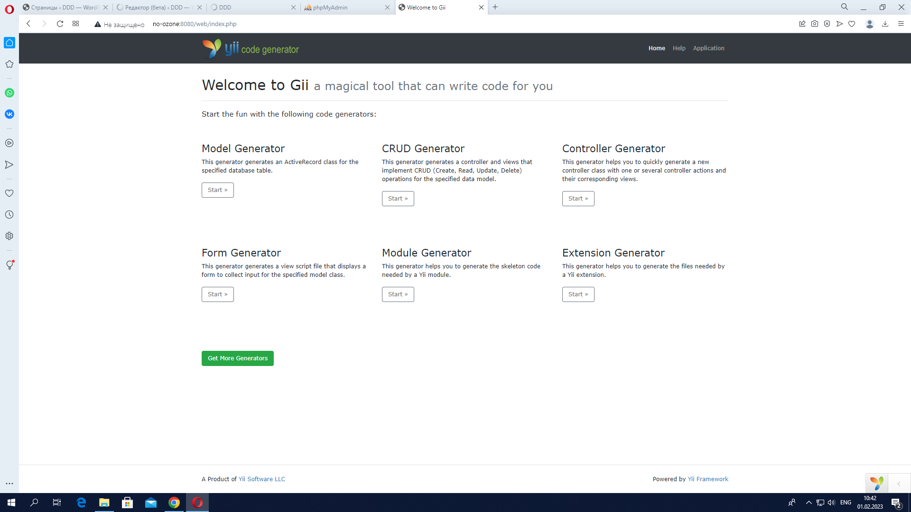
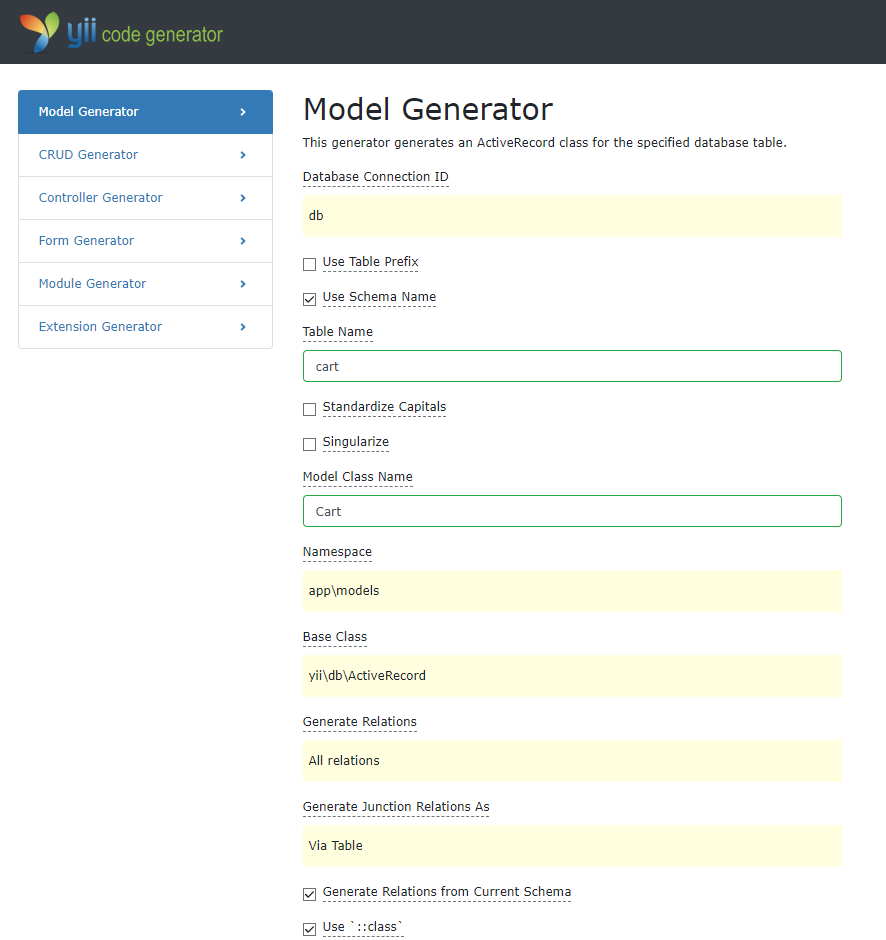
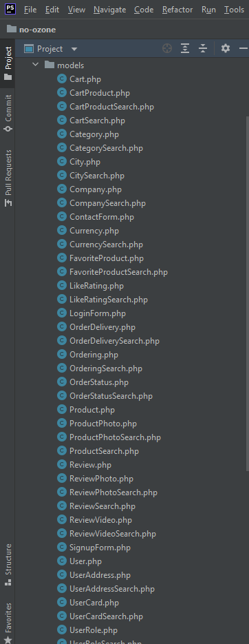
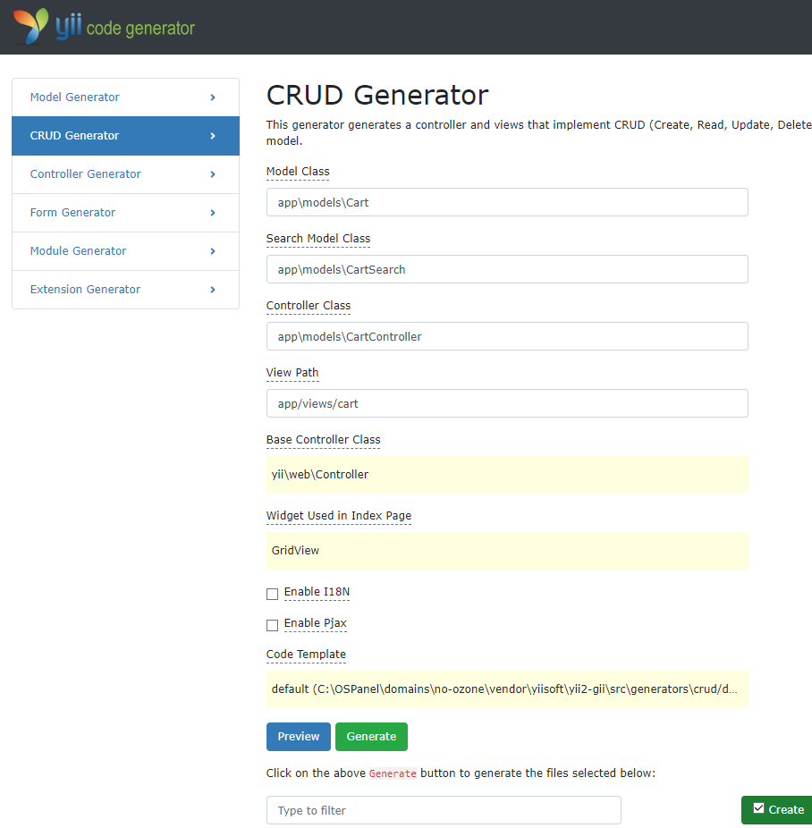
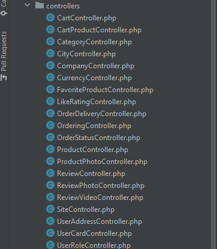

Для удобного просмотра рекомендуется сделать зум сайта: 150%

    
    <h1 align="center">No Ozone - CRUD operations</h1>

<h2>База данных</h2>
В начале всего запускаем Open Server и выставляем в его настройки такие параметры:
 

 

Затем запускаем СУБД PhpMyAdmin, создаём базу данных с названием no_ozone и в параметр импорта добавляем файл no-ozone.sql

<h2>Установка проекта No Ozone</h2>

Если у вас нет Composer, вы можете установить его, следуя инструкциям на сайте <a href="http://getcomposer.org/doc/00-intro.md#installation-nix">getcomposer.org</a>.
С помощью Visual Studio Code клонируем репоситорий с github: https://github.com/Cabarnet/no_ozone.git

Затем открываем композер и вставляем туда следующие команды:
~~~
cd domains/no-ozone
composer update
~~~

<h2>Модели и контроллеры</h2>
В фреймворке Yii2 есть возможность создавать модели и контроллеры прямо на сайте в Gii:

Были созданы модели для всех таблиц:
    

 

    

А так же контроллеры и отображения:
    

 

    

