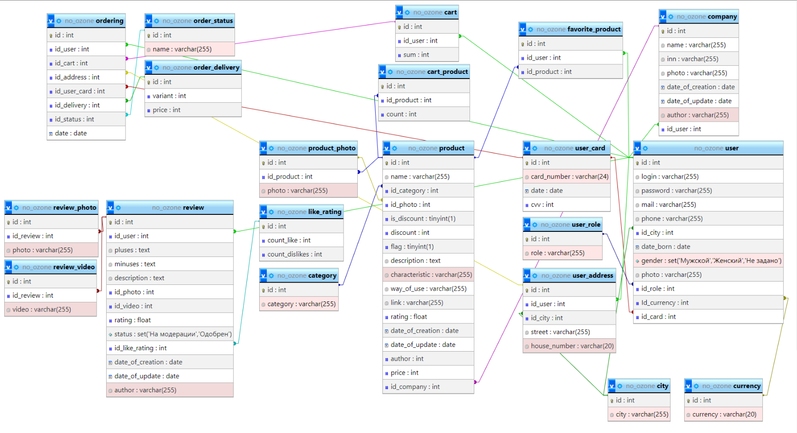
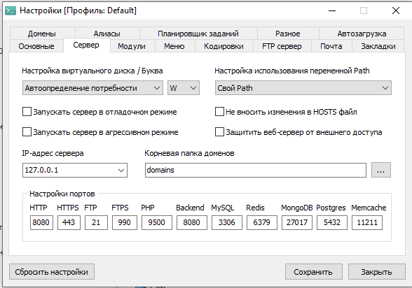
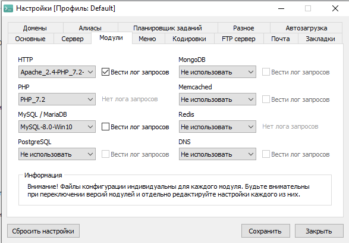

Для удобного просмотра рекомендуется сделать зум сайта: 150%

    
    <h1 align="center">No Ozone - CRUD operations</h1>

<h2>База данных</h2>
В начале всего запускаем Open Server и выставляем в его настройки такие параметры:

Затем запускаем СУБД PhpMyAdmin, создаём базу данных с названием no_ozone и в параметр импорта добавляем файл no-ozone.sql

<h2>Установка Yii2</h2>
Установить через композер
Если у вас нет Composer, вы можете установить его, следуя инструкциям на сайте <a href="http://getcomposer.org/doc/00-intro.md#installation-nix">getcomposer.org</a>.

Затем вы можете установить этот шаблон проекта, используя следующую команду:
~~~
composer create-project --prefer-dist yiisoft/yii2-app-basic basic
~~~
